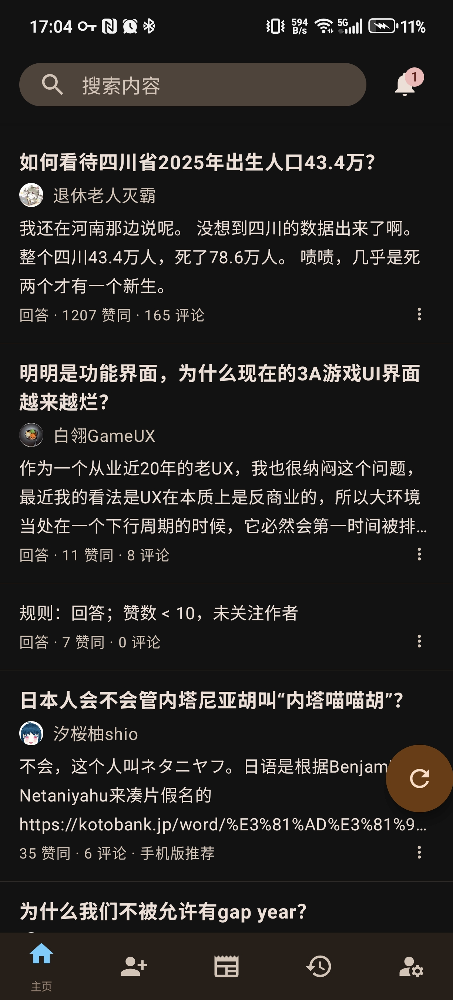
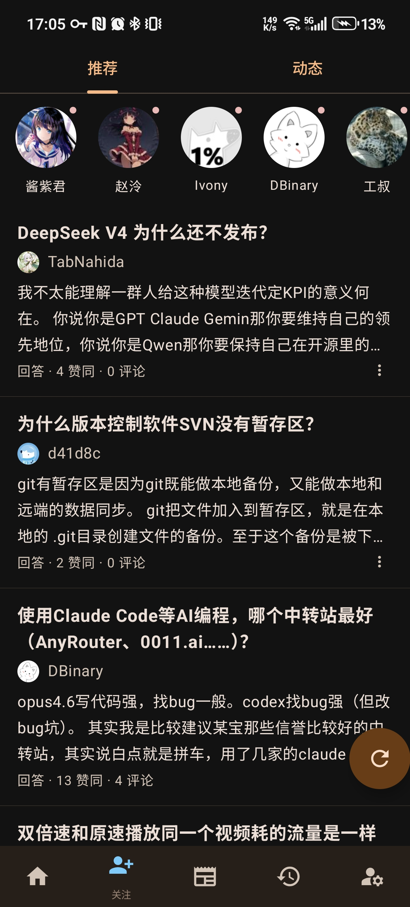
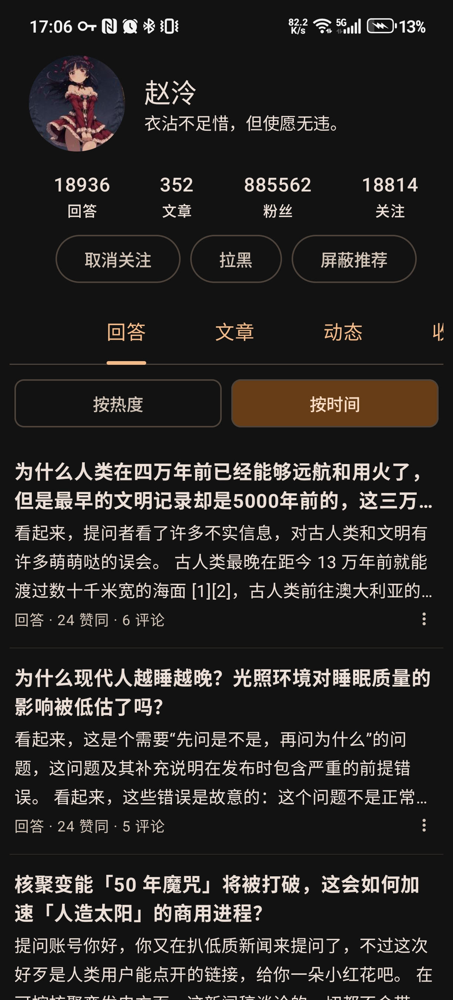
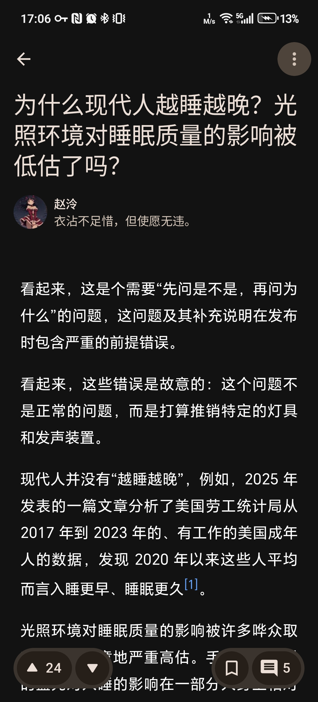

# Zhihu++（知乎·简悦）

注重隐私、去广告、轻量的知乎第三方客户端。

独创**本地推荐算法**，把内容推荐完全放在本地进行，独立于知乎官方算法。你可以自由定制推荐权重，真正看到自己想看的内容，夺回不被算法奴役的权利。

告别知乎 100MB+ 的官方客户端，只要 **不到 4 MB**。

---

## 应用截图

| 首页 | 关注 | 日报 | 个人主页 | 文章 |
| --- | --- | --- | --- | --- |
|  |  |  |  |  |

---

## 下载

- [稳定版下载](https://github.com/Asteroidmple/zhihu-deco/releases)
- [最新开发版](https://github.com/Asteroidmple/zhihu-deco/releases/tag/nightly)

> **关于 Full 与 Lite 版本**
> - **Full**：包含 ONNX 运行时与 HanLP NLP 框架，支持基于 LLM Embedding 的智能内容过滤。体积较大，功能完整。
> - **Lite**：仅含基础功能，无 ML/NLP 推理。体积更小，性能更好，推荐日常使用。

---

## 功能特性

### 账号与登录
- 手机验证码登录
- 扫码在电脑端登录
- 手动设置 Cookie 登录
- 自动刷新登录凭证

### 信息流与推荐
- 首页推荐支持 **Web / Android / 本地 / 混合** 四种模式
- 支持切换 **登录 / 未登录** 状态推荐，打破信息茧房
- 关注页（推荐 / 动态）、热榜、知乎日报、搜索（含热搜）
- 智能内容过滤、质量过滤、反向屏蔽、过滤统计与屏蔽记录
- **支持屏蔽知乎盐选付费内容**

### 内容浏览
- 阅读回答、文章、想法（Pin）
- 问题详情页（排序、关注、日志、分享、评论）
- 收藏夹及收藏夹内容浏览
- 历史记录（在线 + 本地，支持删除）
- 知乎官方认证徽章展示
- 主界面支持横滑切换标签页

### 阅读与互动
- 朗读内容：听文章 / 听回答
- 多 TTS 引擎自动选择（Pico TTS / Sherpa TTS / Google TTS）
- 回答页长按保存图片 **无水印**
- 回答切换手势（上下 / 左右）与"下一个回答"按钮
- AI 总结内容
- **导出内容**（PDF / 图片 / Markdown / HTML）
- **支持导出整个收藏夹**
- 内容划线高亮
- 图片查看器支持动图（GIF）
- 数学公式渲染（LaTeX，字体动态下载）
- 可拖动滚动条、上划 / 下划自动隐藏操作按钮

### 社区与互动
- 个人主页（回答、文章、想法、关注者等）
- 关注 / 拉黑用户、屏蔽推荐
- 评论区（子评论展开、回复、点赞、按时间排序）
- 通知中心（全部标记已读、自动已读、通知筛选）
- 表情包（经典表情 `[惊喜]` 强势回归！）

### 屏蔽系统
- 屏蔽词（支持正则表达式）
- NLP 屏蔽词（基于 LLM Embedding 与向量相似度匹配，仅 Full 版本）
- 屏蔽用户、屏蔽话题
- **屏蔽词导入与导出**（支持跨设备迁移）
- 屏蔽历史记录

### 其他
- 支持 zse96 v2 签名算法（可调用 99% 网页端 API）
- 支持模拟安卓端 API 调用
- Deep Link 与剪贴板链接识别跳转
- 二维码扫码结果展示与复制（支持提取网址、Wi-Fi 密码等）
- 防沉迷提醒
- 支持自定义初始页面
- 双击快速 **点赞** 或 **打开评论区**
- 点击底部导航栏回到顶部 / 刷新

---

## 构建变体

| 变体 | 大小 | 包名 | 功能 |
|------|------|------|------|
| **lite** | ~4 MB | `com.github.zly2006.zhplus.lite` | 基础功能，无 ML/NLP |
| **full** | 较大 | `com.github.zly2006.zhplus` | 完整功能，含 HanLP NLP |

---

## 路线图

### 已经实现
见上方【功能特性】。

### 正在完善 / 欢迎 PR

#### 本地推荐系统（核心功能，优先级最高）
> 当前状态：框架已搭建，但功能不完整，选择"本地推荐"模式可能无法正常工作。

- [ ] Room 数据库初始化修复（KSP 配置与 schema 生成）
- [ ] 相似度推荐算法完善（`LocalRecommendationEngine` 测试与调优）
- [ ] 用户行为记录与分析（`UserBehaviorAnalyzer` 与 UI 事件集成）
- [ ] 爬虫系统完善（`CrawlingExecutor` 错误处理、`ZhihuLocalFeedClientImpl` 内容解析）
- [ ] 混合推荐模式（`MixedHomeFeedViewModel` 在线 + 本地结果合并排序）

#### 内容过滤增强
- [ ] 首页重复内容自动过滤（与推荐系统集成去重）
- [ ] NLP 短语屏蔽优化（添加短语权重学习和自适应阈值）

#### UI/UX 改进
- [ ] 专栏详情页导航
- [ ] Edge-to-Edge 完整适配
- [ ] ModalBottomSheet 动画配置
- [ ] `PeopleScreen` 模块化拆分（当前单文件 1000+ 行）

#### 代码质量
- [ ] 清理 `DataHolder.kt` 中被注释掉的死代码
- [ ] 移除 `build.gradle.kts` 中重复依赖声明
- [ ] `Utils.kt` 中 `telemetry()` 改用结构化并发（替换 `GlobalScope`）

---

## 开发贡献

详见 [CLAUDE.md](./CLAUDE.md)，包含项目结构、构建说明、代码风格约定与调试流程。

---

## 遥测

若您同意（可在设置中关闭），本应用会收集以下匿名数据用于统计：

- 应用启动次数与时间
- 您的 IP 地址
- 经 SHA256 匿名化后的知乎账号 ID（仅当已登录时）

**不会收集** 浏览记录、推荐算法输入输出、屏蔽词列表等敏感信息。

---

## 贡献者

感谢所有为 Zhihu++ 做出贡献的开发者与用户。

---

## See Also

- [Hydrogen](https://github.com/zhihulite/Hydrogen)
- [Zhihu--](https://github.com/huamurui/zhihu-minus-minus)
